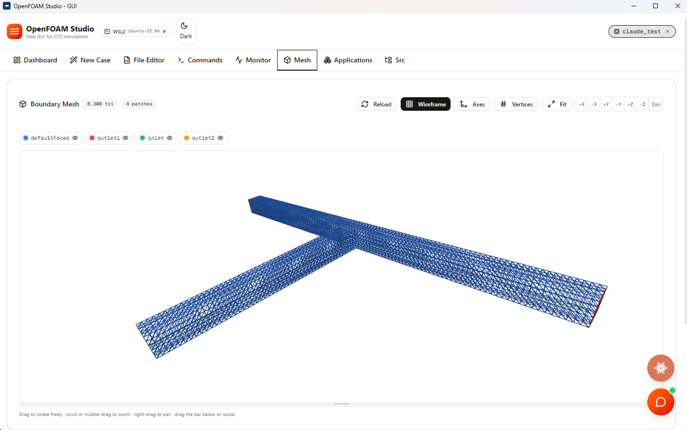
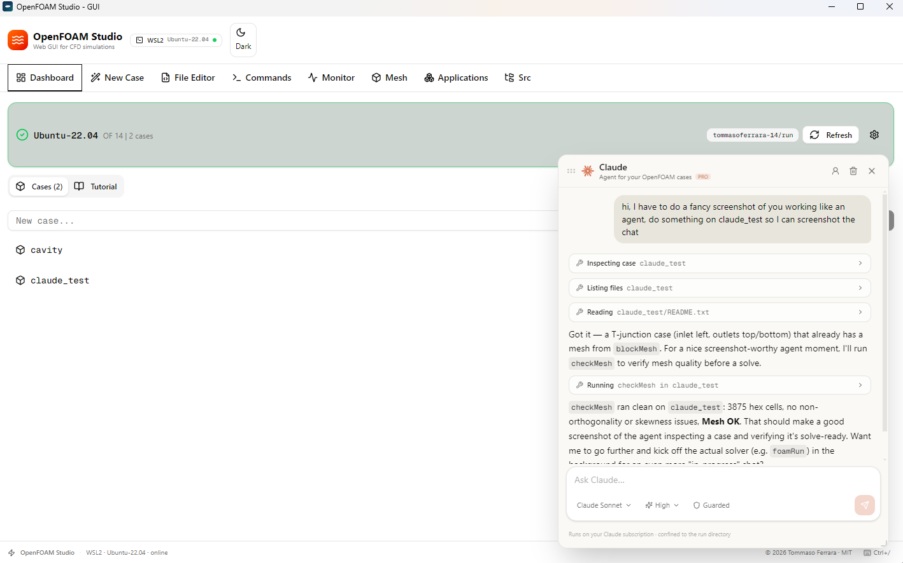

# OpenFOAM Studio

[](https://github.com/Pat2704/openfoam-gui/releases/latest)
[](https://github.com/Pat2704/openfoam-gui/releases)
[](LICENSE)

A desktop GUI for running **OPENFOAM®** CFD simulations inside **WSL2 (Ubuntu)**
on Windows, with three AI helpers built in: **FOAMy**, a copilot that proposes
edits you apply, and **Claude** and **Codex**, agents that do the work themselves.

One portable `.exe`. No installer, no Docker, no Node.js, no browser tab.
Double-click and it opens in its own window.

### → [**Download the latest release**](https://github.com/Pat2704/openfoam-gui/releases/latest)

Windows 10/11 with WSL2. Nothing is installed and nothing is written to the
registry — see [Install](#install) for which of the two files to take.


There is also a [short screen recording](screenshots/gif_openfoam_studio.mp4) of
the app in use.

---

## Install

Two downloads on the [latest release](../../releases/latest) page, same app — pick by how you
want it to start:

| | |
|---|---|
| **`OpenFOAMStudio-v4.0.0-folder.zip`** | **Recommended.** Unzip once, anywhere, then run `OpenFOAMStudio.exe` from the folder. **The window is up in about a tenth of a second.** |
| **`OpenFOAMStudio-v4.0.0-portable.exe`** | One single file, nothing to unzip. Costs about half a minute at every launch: the portable format unpacks the whole app into TEMP each time it starts. |

Either way nothing is installed and nothing is written to the registry — put it
on the Desktop or a USB stick and double-click.

If you take the .zip, make sure the extraction **finishes**: it holds about
1,700 files, and Windows Explorer has been seen giving up part-way without
saying so. The app checks on startup and tells you if files are missing, but
extracting with PowerShell avoids the problem:

```powershell
Expand-Archive OpenFOAMStudio-v4.0.0-folder.zip -DestinationPath OpenFOAMStudio
```

Windows SmartScreen will warn on first run because the executable is unsigned:
**More info → Run anyway**.

### Requirements

| | |
|---|---|
| Windows | 10 (build 19041+) or 11, 64-bit |
| WSL2 + Ubuntu | 22.04 or 24.04 — check with `wsl --list -v` |
| OpenFOAM | v9 → v14, installed inside WSL |
| ParaView | optional, for the integrated ParaView tab; installed on Windows |
| LLM API key | optional, only for the FOAMy chat |
| Claude desktop app | optional, only for the Claude agent — it runs on your subscription |
| Codex CLI | optional, only for the Codex agent — it runs on your ChatGPT subscription |

Node.js is **not** needed — one is bundled inside the `.exe`.

Don't have OpenFOAM yet? Inside WSL Ubuntu:

```bash
sudo sh -c "wget -O - https://dl.openfoam.org/gpg.key > /etc/apt/trusted.gpg.d/openfoam.asc"
sudo add-apt-repository http://dl.openfoam.org/ubuntu
sudo apt update && sudo apt install openfoam14
```

The app auto-detects every version in `/opt/openfoam*`, `/usr/lib/openfoam/*`
and `/usr/local/OpenFOAM-*`, and you can switch between them from the gear on
the **OpenFOAM card in the Dashboard**.

---

## What it does

- **Dashboard** — browse cases in `$FOAM_RUN`, switch WSL distro or OpenFOAM
  version, copy official tutorials.
- **New Case** — guided wizard from a template (cavity, pipe flow, airfoil,
  dam break, motorbike…). It reads the installed OpenFOAM version and writes
  the case in the layout that version actually wants, then preflights it before
  you leave the wizard.

  
- **File Editor** — view, edit, create and delete case files.
- **Commands** — run `blockMesh`, `foamRun`, `snappyHexMesh`… with a command
  list filtered to the OpenFOAM version in use. One-click **Allrun** launches
  the case script in the background and takes you to the Monitor.
- **Monitor** — live log tail, residual plot, running processes with per-PID
  kill.

  
- **Mesh** — 3D view of the case's boundary patches: orbit/zoom/pan, wireframe,
  per-patch colour and visibility, XYZ axes, standard views (±X/±Y/±Z and
  isometric), and the `blockMeshDict` vertex numbers overlaid on the model.
  Drag the bar under the view to make it taller. `checkMesh` and boundary-
  condition validation live here too.

  
- **Post-Process** — the numbers the run produced, rather than the picture. It
  reads everything OpenFOAM's function objects wrote under `postProcessing/` —
  force coefficients, flow rates, pressure drops, y+, probe histories, sampled
  profiles — and charts them with a log/linear axis, a data table and CSV on the
  clipboard. Beside each series it reports the last value, the mean over the
  final fifth, the min/max and whether the quantity has settled or is still
  drifting. A case that has no function objects yet is not a dead end:
  **Compute…** lists the ones this OpenFOAM installation ships (127 on v14),
  with the description and input fields read from the installation's own
  templates, and runs the one you pick over the timesteps already on disk.
  Time series are stitched across restarts, with a later run's recomputed values
  replacing the older ones; sampled profiles keep one curve per written time and
  give you a time selector instead. **Follow** re-reads every few seconds, so a
  drag coefficient can be watched while the solver is still running.

  The same panel also lists the case's **solver logs** and plots their initial
  residuals, so a convergence history is read, compared and exported the same
  way as everything else.

  **Save chart** opens the picture before it is written: pick the output size,
  the background (white, dark, transparent or your own two colours), the title,
  the axis names, the grid, the legend, the font size and the line weight. The
  preview is not a mock-up of the file — it is the file, scaled to fit the
  dialog. SVG stays sharp at any size and keeps its text selectable; PNG is
  rasterised from that same drawing at 1×, 2× or 3×.

  **Compute…** gives you one editable line rather than a form: the call is
  prefilled from the installation's own template, with its real argument names,
  the examples the template documents, and a patch your case actually has. What
  each argument means is listed underneath. A second box shows the
  `functions { #includeFunc … }` entry that runs the same thing during the
  solve — to copy into `controlDict` yourself; the app never edits it for you.
- **ParaView** — use a ParaView-style workbench without leaving the app. A real
  background `pvpython` session owns the OpenFOAM reader, filter pipeline and
  offscreen renderer. Select volume, patch and group regions; switch between
  reconstructed and decomposed cases; and build a capability-detected catalogue
  of slicing, clipping, tracing, geometry, sampling and analysis filters. Slice,
  Clip, Stream Tracer and Plot Over Line also expose draggable 3D plane, sphere
  and line manipulators. The Information panel reports the case extents, centre
  and dimensions along colour-coded X/Y/Z axes. Camera movement and timestep
  scrubbing remain at full viewport resolution, with coalesced requests keeping
  interaction responsive. The Pipeline Browser can also open supported STL,
  OBJ, PLY, VTK/XML, PVD, XDMF, EnSight, Exodus and CSV files found inside the
  active case, including its subfolders. Mesh-only cases remain usable, and
  detection assumes neither a versioned folder name nor an install directory.
- **Applications / Src** — browse the installed OpenFOAM sources.

<details>
<summary>Four more: the command panel, the file editor, the applications and source browsers</summary>


</details>

- **FOAMy** — a chat copilot that reads your case files and proposes edits you
  can apply with one click.
- **Claude** — an agent that reads, writes and runs your cases itself, on your
  Claude subscription. Same idea, opposite direction: FOAMy hands you a file to
  approve, Claude changes the case and tells you what it did.

  

- **Codex** — an OpenAI agent with the same case access and controls as Claude,
  using your ChatGPT subscription. Its black ChatGPT-logo launcher sits above Claude's; it has
  its own account, model and reasoning settings.

### Keyboard shortcuts

`Ctrl+0…9` switch tab, in order · `Ctrl+S` save file · `Ctrl+Enter` send to FOAMy ·
`Ctrl+B` light/dark · `Ctrl+F` search in file · `Ctrl+/` show shortcuts

---

## Setting up FOAMy (optional)

Click the orange button (bottom-right) → gear icon → **LLM Configuration**.
Pick a provider, paste your API key, choose a model, **Save**.

| Provider | Base URL | Suggested model |
|---|---|---|
| Groq | `https://api.groq.com/openai/v1` | `llama-3.3-70b-versatile` |
| OpenAI | `https://api.openai.com/v1` | `gpt-4o-mini` |
| Anthropic | `https://api.anthropic.com` | `claude-sonnet-4-20250514` |
| Custom | e.g. `http://localhost:11434/v1` for Ollama | your own |

Your key is stored **on your machine only**, encrypted with your Windows user
account, and never travels inside the `.exe` — anyone you send the executable
to starts with nothing configured. Everything except the chat works without it.

---

## Setting up the Claude agent (optional)

Click the orange burst button (bottom-right, above FOAMy's) → **Sign in**. Your
browser opens once; after that the panel is ready.

It needs the **Claude desktop app** installed, because that is where the Claude
Code it drives — and your subscription — lives. There is no API key and nothing
is billed per message: the agent runs on the plan you already pay for. The app
finds the binary by itself (newest version under
`%APPDATA%\Claude\claude-code\`); set `OFSTUDIO_CLAUDE_PATH` if yours lives
somewhere unusual.

**What it is allowed to do**, and cannot be talked out of:

- read and write files inside your **run directory only** — case names and
  paths go through the same validators the rest of the app uses, so `..`, an
  absolute path or a symlink gets it nowhere;
- run **only executables this OpenFOAM installation actually ships** (156 of
  them, read from the installation itself), one command per call — no pipes, no
  redirects, no chaining;
- **nothing else.** It has no shell, no filesystem access outside those tools,
  and no web access. `rm` and `mv` are not on the list, so deleting or moving a
  file is not something it can express — it will tell you to do it yourself.

**Unrestricted mode.** The shield button in the composer says `Guarded` by
default: Claude may only run the OpenFOAM executables this installation ships,
one per call, with no shell syntax. Switch it to `No limits` — one click, no dialog —
and `run_openfoam` becomes a real shell inside the case directory: any command,
pipes, redirects, chaining, including ones that delete or overwrite. Every call
still appears in the conversation as it happens, and in the activity log tagged
`[unrestricted]`.

One limit survives even there: **paths under `/mnt/` are refused**. That is the
Windows disk as WSL sees it — your documents, and this app'"'"'s own files — and no
OpenFOAM work needs to reach it. Everything inside WSL is fair game, which is
the point of the mode. The setting is remembered, and changing it restarts the agent
while keeping the conversation.

Model and reasoning depth are chosen in the composer, the way Claude Desktop
does it. Every tool call appears in the conversation as a card you can open, so
what it read, wrote and ran is on screen rather than in a log file.

---

## Setting up the Codex agent (optional)

Click the black ChatGPT-logo button above Claude's launcher → **Sign in**. Codex opens
your browser once and uses your ChatGPT subscription; it does not need an API
key. The panel keeps its own Codex home, so signing in or out there does not
change any other Codex desktop or CLI login on the machine.

It needs **Codex CLI 0.153.1 or newer**. The app finds the native executable in
the Codex desktop app, a global npm installation, `PATH`, or the optional
`OFSTUDIO_CODEX_PATH` environment variable. If it cannot find one, enter the
absolute path to `codex.exe` in the panel. A global installation is:

```bash
npm install -g @openai/codex
```

Codex receives exactly the same OpenFOAM tools as Claude: it can read and write
inside the run directory and run only installed OpenFOAM commands in `Guarded`
mode. `No limits` enables a WSL shell inside the case directory, with the same
`/mnt/` protection and visible activity cards. It has no inherited desktop
skills, plugins, MCP servers, shell, filesystem or web tools: every action goes
through the app's shared OpenFOAM policy.

---

## Setting up ParaView (optional)

Install a Windows build of ParaView. The **Dashboard** reports its status beside
Ubuntu/OpenFOAM; OpenFOAM Studio searches `PATH`, Windows installation records,
Program Files and Local AppData, probes each `pvpython.exe` it finds, and selects
the newest usable version. No fixed version or installation directory is assumed.

For a portable copy or custom directory, use the gear on the **ParaView card in
the Dashboard**, enter the ParaView folder, `paraview.exe`, or `pvpython.exe`,
and click **Save path**. The choice is stored locally. ParaView is not bundled;
it runs as a separate background process only when a case is opened in its
workbench.

---

## Troubleshooting

**The WSL2 badge is red** — run `wsl --status`; if the distro hangs, `wsl --shutdown`
and reopen. Multiple distros? Dashboard → ⚙️ → change distro.

**"No OpenFOAM version found"** — it isn't in a standard path. Symlink it:
`sudo ln -s /yourpath/OpenFOAM-X /opt/openfoam/OpenFOAM-X`.

**Blank window / "Server did not start"** — launch the `.exe` from a terminal;
the bundled server's output is printed there with a `[server]` prefix.

**FOAMy doesn't answer** — gear icon → check provider, key and model are saved,
then **Test connection**.

**"Claude Code is not installed here"** — the agent needs the Claude desktop
app. If it is installed somewhere the app does not look, set
`OFSTUDIO_CLAUDE_PATH` to the full path of `claude.exe`.

**The agent says it is not signed in** — open the account icon in the panel
header and click **Sign in**. It uses your Claude subscription, not an API key,
so a signed-out CLI is the only thing that stops it.

**"Claude Code was not found" although the Claude app is installed** — the copy
of the CLI bundled inside the desktop app is not always readable by other
programs. Install the CLI itself, which lands somewhere any program can reach:

```bash
npm install -g @anthropic-ai/claude-code
```

Or type the full path to your `claude.exe` in the box on that screen. **Look
again** forces a fresh search and lists every path tried with the reason it
failed.

**"Codex CLI was not found"** — install it with `npm install -g @openai/codex`,
then click **Look again** in the Codex panel. You can also enter the full path
to `codex.exe`; the panel shows each attempted path and why it was rejected.

**"ParaView workbench is not available"** — check the ParaView status on the
Dashboard and click **Look again**. For a portable or non-standard copy, open
Dashboard settings and enter its directory or the full path to `pvpython.exe`.
A first case load can take noticeably longer because ParaView initializes its
OpenFOAM reader and renderer in a separate process. A case containing only the
initial `0` directory is intentionally labelled **mesh only**; Surface With
Edges, Wireframe, Points and Outline are still available, while animation is
disabled until solver result times exist.

---

## Building from source

```bash
npm install
npm run electron:build     # → dist-electron/OpenFOAMStudio-v<version>-portable.exe
                           #   and dist-electron/OpenFOAMStudio-v<version>-folder.zip
```

Other commands: `npm run dev` (browser, hot reload, port 3000) ·
`npm test` (unit tests) · `npm run check` (typecheck + lint + tests) ·
`npm start` (built server, no Electron).

The tests run on `node --test` with Node's own TypeScript support, so there is no test
framework to install and no build step — `npm test` works on a fresh clone. They cover
the parts where a mistake is silent: the input validators that everything reaching
`wsl.exe` passes through, and the case generator, whose output has to be accepted by
two incompatible OpenFOAM layouts (≤10 and 11+).

Electron `31.7.7` and the bundled Node `20.20.2` are pinned in
`electron/electron-builder.yml` and `electron/scripts/prepare-resources.js`.

### Layout

| Path | |
|---|---|
| `electron/main.js` | spawns the server, opens the window, stores the FOAMy config |
| `electron/preload.js` | the only renderer↔main bridge (FOAMy config) |
| `electron/mcp/openfoam-mcp.mjs` | the agent's tool server — dependency-free, launched by the app |
| `src/lib/wsl.ts` | every OpenFOAM interaction goes through here |
| `src/lib/foamy-store.ts` | where the API key is persisted |
| `src/lib/claude-cli.ts` | finds, authenticates and drives the Claude Code process |
| `src/lib/codex-cli.ts` | finds, authenticates and drives the isolated Codex app-server process |
| `src/lib/agent-policy.ts` | what the agent may do, and the record of what it did |
| `src/lib/postprocess.ts` | parses what the function objects wrote, and the templates that describe them |
| `src/lib/residuals.ts` | reads solver residuals out of a log — shared by the Monitor and Post-Process |
| `src/components/openfoam/chart-export.tsx` | the chart-to-picture dialog |
| `src/lib/stl.ts` | ASCII STL parser + the binary wire format `/api/mesh` returns |
| `src/lib/paraview.ts` | version-independent discovery and persistent headless ParaView workbench |
| `src/components/openfoam/mesh-viewer.tsx` | the three.js boundary-mesh viewer |
| `src/app/api/**` | REST endpoints the UI talks to |
| `src/components/openfoam/**` | the tabs |
| `scripts/build-electron.js` | next build → resources → electron-builder |

### Three traps to know about

These bite **only in the packaged app** — none of them reproduce with
`npm run dev`, so never validate these areas from the dev server alone.

1. **`window.confirm()` / `alert()` are banned.** A native modal often fails to
   return keyboard focus to the page, freezing every text input until you click
   another app and back. Use `confirmDialog()` from
   `src/components/ui/confirm-host.tsx`.
2. **Every `child_process` call in `src/lib/wsl.ts` passes `windowsHide: true`.**
   Without it Windows opens a console window per `wsl.exe` child, which flashes
   and steals focus — same symptom as above.
3. **The server port is chosen at launch**, so the page origin changes every
   run and `localStorage` is empty each time. Anything that must persist goes
   through `src/lib/foamy-store.ts`.

Hardware acceleration is deliberately ENABLED (the Mesh tab needs real WebGL —
with the GPU switches on, the renderer falls back to SwiftShader). The comment
at the top of `electron/main.js` explains what to re-add if the input freeze
ever returns.

Also: don't put secrets in `.env` — that file is copied into the `.exe`.

---

## License & credits

OpenFOAM Studio is open source under the **MIT License**.

Copyright © 2026 Tommaso Ferrara. The full text is in `LICENSE`. You may use,
modify, distribute and sell this software, including in closed-source products,
provided the copyright notice and the license text travel with every copy. The
software is provided "as is", without warranties.

The third-party components embedded in the packaged application are listed in
`THIRD-PARTY-NOTICES.md`, which ships alongside the binaries.

**OpenFOAM itself is not part of this project.** It is free software released
under the GNU GPL v3 by The OpenFOAM Foundation. OpenFOAM Studio runs it as a
separate program inside WSL2; it does not link against it and redistributes no
part of it.

OPENFOAM® is a registered trade mark of OpenCFD Limited, producer and
distributor of the OpenFOAM software via www.openfoam.com.

This offering is not approved or endorsed by OpenCFD Limited, producer and
distributor of the OpenFOAM software via www.openfoam.com, and owner of the
OPENFOAM® and OpenCFD® trade marks.
