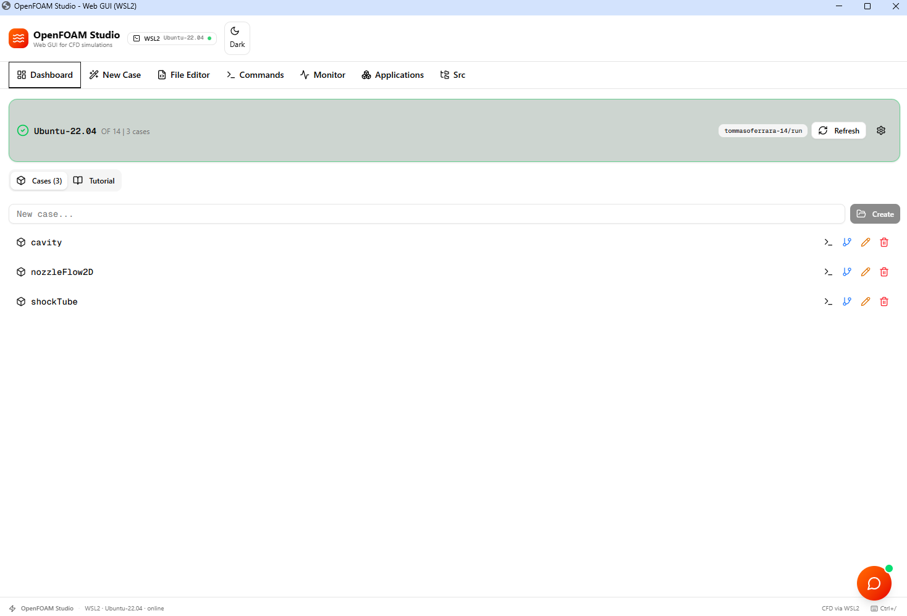
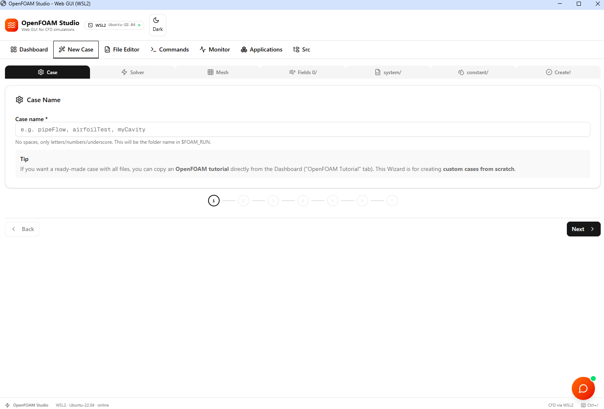
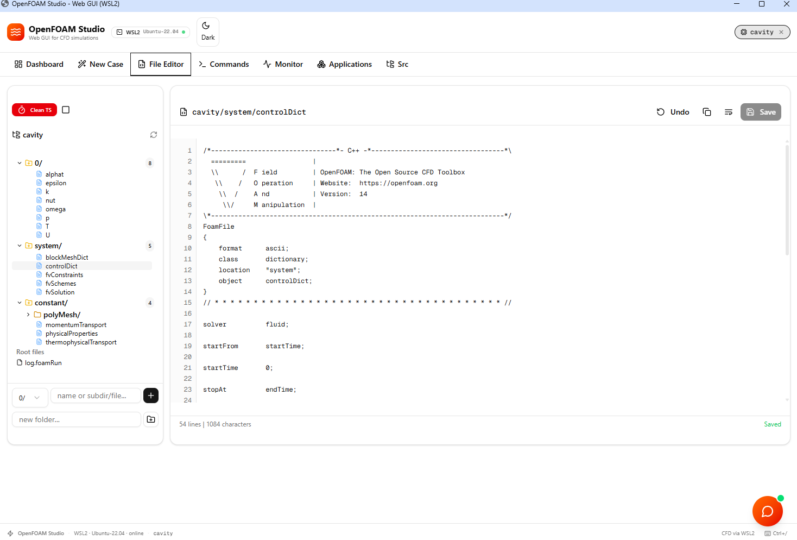
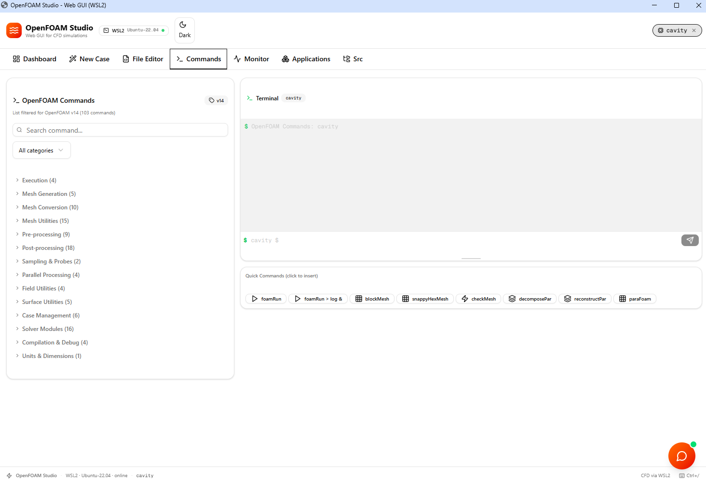
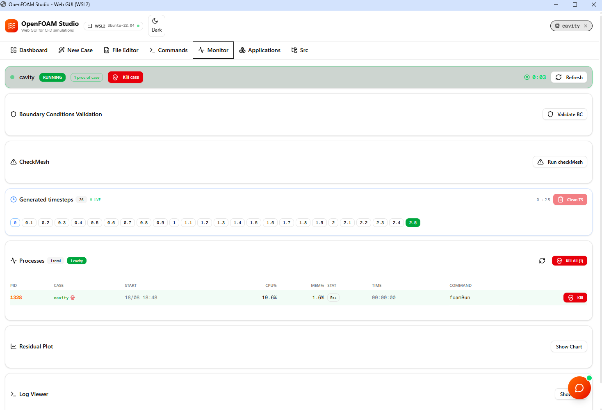
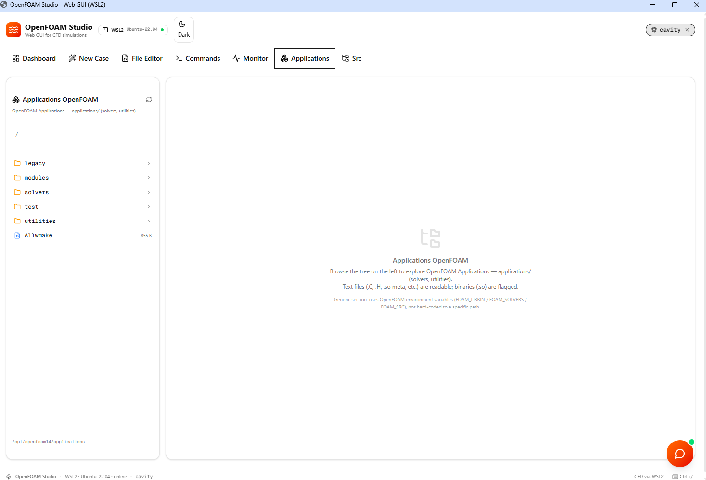
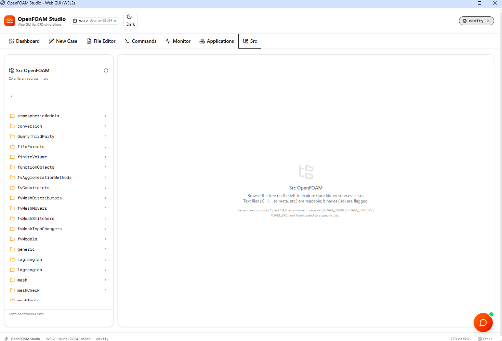

# OpenFOAM Studio

A desktop GUI for running **OpenFOAM** CFD simulations inside **WSL2 (Ubuntu)**
on Windows, with an integrated AI copilot (**FOAMy**).

One portable `.exe`. No installer, no Docker, no Node.js, no browser tab.
Double-click and it opens in its own window.



<details>
<summary><b>More screenshots</b> — case wizard, editor, commands, monitor, sources</summary>








</details>

A short demo is in [`screenshots/gif_openfoam_studio.mp4`](screenshots/gif_openfoam_studio.mp4).

---

## Install

1. Download **`OpenFOAMStudio-v1.4-portable.exe`** from the [Releases](../../releases) page.
2. Put it anywhere (Desktop, a USB stick — it writes nothing to the registry).
3. Double-click it.

Windows SmartScreen will warn on first run because the executable is unsigned:
**More info → Run anyway**.

### Requirements

| | |
|---|---|
| Windows | 10 (build 19041+) or 11, 64-bit |
| WSL2 + Ubuntu | 22.04 or 24.04 — check with `wsl --list -v` |
| OpenFOAM | v9 → v14, installed inside WSL |
| LLM API key | optional, only for the FOAMy chat |

Node.js is **not** needed — one is bundled inside the `.exe`.

Don't have OpenFOAM yet? Inside WSL Ubuntu:

```bash
sudo sh -c "wget -O - https://dl.openfoam.org/gpg.key > /etc/apt/trusted.gpg.d/openfoam.asc"
sudo add-apt-repository http://dl.openfoam.org/ubuntu
sudo apt update && sudo apt install openfoam14
```

The app auto-detects every version in `/opt/openfoam*`, `/usr/lib/openfoam/*`
and `/usr/local/OpenFOAM-*`, and you can switch between them from
**Dashboard → ⚙️ → OpenFOAM Version**.

---

## What it does

- **Dashboard** — browse cases in `$FOAM_RUN`, switch WSL distro or OpenFOAM
  version, copy official tutorials.
- **New Case** — guided wizard from a template (cavity, pipe flow, airfoil,
  dam break, motorbike…).
- **File Editor** — view, edit, create and delete case files.
- **Commands** — run `blockMesh`, `foamRun`, `snappyHexMesh`… with a command
  list filtered to the OpenFOAM version in use. One-click **Allrun** launches
  the case script in the background and takes you to the Monitor.
- **Monitor** — live log tail, residual plot, running processes with per-PID
  kill.
- **Mesh** — 3D view of the case's boundary patches: orbit/zoom/pan, wireframe,
  per-patch colour and visibility, XYZ axes, standard views (±X/±Y/±Z and
  isometric), and the `blockMeshDict` vertex numbers overlaid on the model.
  Drag the bar under the view to make it taller. `checkMesh` and boundary-
  condition validation live here too.
- **Applications / Src** — browse the installed OpenFOAM sources.
- **FOAMy** — a chat copilot that reads your case files and proposes edits you
  can apply with one click.

### Keyboard shortcuts

`Ctrl+1…7` switch tab · `Ctrl+S` save file · `Ctrl+Enter` send to FOAMy ·
`Ctrl+B` light/dark · `Ctrl+F` search in file · `Ctrl+/` show shortcuts

---

## Setting up FOAMy (optional)

Click the orange button (bottom-right) → gear icon → **LLM Configuration**.
Pick a provider, paste your API key, choose a model, **Save**.

| Provider | Base URL | Suggested model |
|---|---|---|
| Groq | `https://api.groq.com/openai/v1` | `llama-3.3-70b-versatile` |
| OpenAI | `https://api.openai.com/v1` | `gpt-4o-mini` |
| Anthropic | `https://api.anthropic.com` | `claude-sonnet-4-20250514` |
| Custom | e.g. `http://localhost:11434/v1` for Ollama | your own |

Your key is stored **on your machine only**, encrypted with your Windows user
account, and never travels inside the `.exe` — anyone you send the executable
to starts with nothing configured. Everything except the chat works without it.

---

## Troubleshooting

**The WSL2 badge is red** — run `wsl --status`; if the distro hangs, `wsl --shutdown`
and reopen. Multiple distros? Dashboard → ⚙️ → change distro.

**"No OpenFOAM version found"** — it isn't in a standard path. Symlink it:
`sudo ln -s /yourpath/OpenFOAM-X /opt/openfoam/OpenFOAM-X`.

**Blank window / "Server did not start"** — launch the `.exe` from a terminal;
the bundled server's output is printed there with a `[server]` prefix.

**FOAMy doesn't answer** — gear icon → check provider, key and model are saved,
then **Test connection**.

---

## Building from source

```bash
npm install
npm run electron:build     # → dist-electron/OpenFOAMStudio-v1.4-portable.exe
```

Other commands: `npm run dev` (browser, hot reload, port 3000) ·
`npm run check` (typecheck + lint) · `npm start` (built server, no Electron).

Electron `31.7.7` and the bundled Node `20.20.2` are pinned in
`electron/electron-builder.yml` and `electron/scripts/prepare-resources.js`.

### Layout

| Path | |
|---|---|
| `electron/main.js` | spawns the server, opens the window, stores the FOAMy config |
| `electron/preload.js` | the only renderer↔main bridge (FOAMy config) |
| `src/lib/wsl.ts` | every OpenFOAM interaction goes through here |
| `src/lib/foamy-store.ts` | where the API key is persisted |
| `src/lib/stl.ts` | ASCII STL parser + the binary wire format `/api/mesh` returns |
| `src/components/openfoam/mesh-viewer.tsx` | the three.js boundary-mesh viewer |
| `src/app/api/**` | REST endpoints the UI talks to |
| `src/components/openfoam/**` | the tabs |
| `scripts/build-electron.js` | next build → resources → electron-builder |

### Three traps to know about

These bite **only in the packaged app** — none of them reproduce with
`npm run dev`, so never validate these areas from the dev server alone.

1. **`window.confirm()` / `alert()` are banned.** A native modal often fails to
   return keyboard focus to the page, freezing every text input until you click
   another app and back. Use `confirmDialog()` from
   `src/components/ui/confirm-host.tsx`.
2. **Every `child_process` call in `src/lib/wsl.ts` passes `windowsHide: true`.**
   Without it Windows opens a console window per `wsl.exe` child, which flashes
   and steals focus — same symptom as above.
3. **The server port is chosen at launch**, so the page origin changes every
   run and `localStorage` is empty each time. Anything that must persist goes
   through `src/lib/foamy-store.ts`.

Hardware acceleration is deliberately ENABLED (the Mesh tab needs real WebGL —
with the GPU switches on, the renderer falls back to SwiftShader). The comment
at the top of `electron/main.js` explains what to re-add if the input freeze
ever returns.

Also: don't put secrets in `.env` — that file is copied into the `.exe`.

---

## License & credits

OpenFOAM is free software released under the GNU GPL v3 by The OpenFOAM
Foundation. This GUI is independent and not affiliated with them, and is
provided "as is", without warranties.
